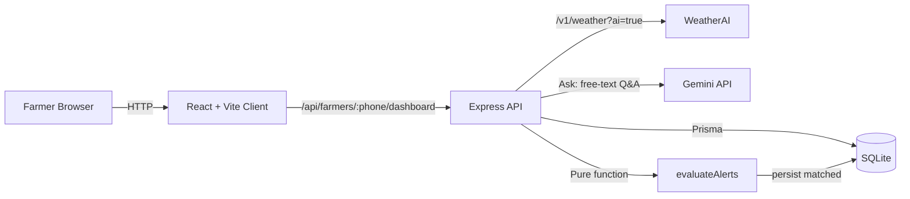

# AgriAlert

> **Weather intelligence for farmers — AI-powered, crop-aware, built for the field.**

AgriAlert combines real-time weather data from [WeatherAI](https://weather-ai.co) with AI-generated agronomic insights, delivered through a clean web dashboard tailored to each farmer's location and crop.

Built as a submission for the WeatherAI developer challenge — see [Submission context](#submission-context) below.

---

## The Problem

Farmers across Africa make critical decisions — when to plant, irrigate, harvest, or protect livestock — based on incomplete or generic weather information. Mainstream weather apps don't understand crops, don't speak to local agronomic risk, and don't translate raw data into action.

**AgriAlert closes that gap**: AI-interpreted weather, contextualized per farm and crop, surfaced as plain-language recommendations a farmer can act on today.

---

## Key Features

- **Farmer profile** — register with phone, location, and primary crop type
- **Smart dashboard** — current conditions, 7-day forecast, and a 24h hourly chart
- **AI agronomic insights** — crop-aware summary baked into the WeatherAI `/v1/weather?ai=true` response
- **"Ask about my farm"** — free-text Q&A grounded in the farmer's location, crop, and live forecast
- **Crop-aware alerts** — `rain`, `frost`, `extreme_wind`, `drought` triggers evaluated per farmer on every dashboard load
- **Alert history** — chronological feed of past matched alerts (deduped per `farmer + trigger + day`)
- **Configurable triggers** — farmers pick which alert types they care about

---

## Architecture



**Why this shape**

- **Single `/dashboard` round-trip** — current + 7-day + 24h hourly + AI insight + evaluated alerts, in one request, off one WeatherAI fetch.
- **Alerts are derived state, not scheduled work.** The evaluator is a pure function over the forecast payload. It runs synchronously on dashboard load — no cron, no worker, no background process. The same function plugs into a `node-cron` worker (Phase 2) and into WeatherAI webhooks (Phase 3) without rewrites.
- **Forecast cache (30 min, in-memory per farmer)** protects the WeatherAI quota under repeated page loads. A "Re-check conditions" button passes `?force=true` to bypass.
- **Server-side proxy** — the WeatherAI key never reaches the browser.

See the full [product spec](./AgriAlert%20_product_spec.md) for the data model, API surface, alert engine, and production roadmap.

---

## Tech Stack

| Layer | Tech |
|---|---|
| Frontend | React 18 + Vite + JavaScript |
| Styling | Tailwind CSS + shadcn/ui primitives |
| Data fetching | TanStack Query |
| Charts | Recharts |
| Backend | Node.js 20 + Express |
| Database | SQLite (via Prisma) — Postgres-portable schema |
| ORM | Prisma |
| Weather data + AI summary | [WeatherAI](https://weather-ai.co) — `/v1/weather?ai=true` (Free plan) |
| Free-text Q&A | Google Gemini (`gemini-flash-latest`) — see [AI provider note](#ai-provider-note) |
| Hosting | Netlify (frontend) · Render (backend) |
| Structure | Monorepo: `/client` + `/server` |

### AI provider note

The WeatherAI **Free** plan includes the AI summary built into `/v1/weather?ai=true` (used for the dashboard insight) but **not** `/v1/insights` (Pro+). For the free-text "Ask about my farm" flow, AgriAlert calls Gemini directly using the same farmer + forecast + crop context.

Upgrading to WeatherAI Pro is a one-file swap in [`server/services/ask.service.js`](./server/services/ask.service.js): replace the Gemini client with a `GET /v1/insights` call. Input shape and output shape stay identical.

---

## Getting Started

### Prerequisites

- Node.js **20+**
- A WeatherAI API key — sign up at [weather-ai.co](https://weather-ai.co), copy your `wai_…` key from **Dashboard → API Keys**
- A Gemini API key — get one at [aistudio.google.com/apikey](https://aistudio.google.com/apikey)

### Install & run

```bash
# from the AgriAlert/ folder
npm install

# configure env vars
cp server/.env.example server/.env
cp client/.env.example client/.env
# then edit server/.env and add your WEATHER_API_KEY and GEMINI_API_KEY

# create the SQLite database + apply migrations
npm run prisma:migrate -w server

# seed one demo farmer (Bomet, Tea)
npm run prisma:seed -w server

# start client (5173) + server (3000) together
npm run dev
```

Open <http://localhost:5173>. The seeded demo farmer's phone will be pre-filled so the dashboard loads in zero clicks.

### Useful scripts

```bash
npm run dev              # client + server together
npm run dev:client       # client only
npm run dev:server       # server only
npm run build            # build both
npm run lint             # lint both
```

---

## Demo

Live deployment: _coming soon_

Demo farmer (after seeding):

- **Phone**: `+254700000001`
- **Location**: Kapkimolwa, Bomet, Kenya
- **Crop**: Tea

---

## Project structure

```
AgriAlert/
├── client/              # React + Vite frontend
│   └── src/
│       ├── api/         # API client (fetch wrappers + React Query hooks)
│       ├── components/  # Shared UI components
│       ├── hooks/       # Custom hooks
│       └── pages/       # Route components
├── server/              # Express + Prisma backend
│   ├── controllers/     # Thin HTTP handlers
│   ├── services/
│   │   ├── alert/       # Pure-function alert engine (rain/frost/wind/drought)
│   │   ├── ai/          # Gemini integration for free-text Q&A
│   │   └── weather.service.js   # WeatherAI client + normalization
│   ├── routes/
│   ├── middleware/
│   ├── prisma/          # Schema + migrations + seed
│   └── test/            # Pure-function tests + ad-hoc HTTP smoke tests
└── package.json         # npm workspaces root
```

---

## Submission context

This repo is a submission for the WeatherAI developer challenge:

> Build a simple application or implementation of your choice that integrates any of our APIs from our [developer platform](https://weather-ai.co/docs). We want to see how you consume our data and translate it into a clean, functional project.

**Deliverables:**

- Public GitHub repo with this README and setup instructions ✅
- Live deployment link — see [Demo](#demo) section above ⏳
- Architectural rationale — see the [product spec](./AgriAlert%20_product_spec.md) ✅
